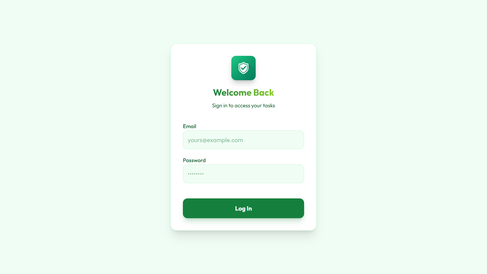
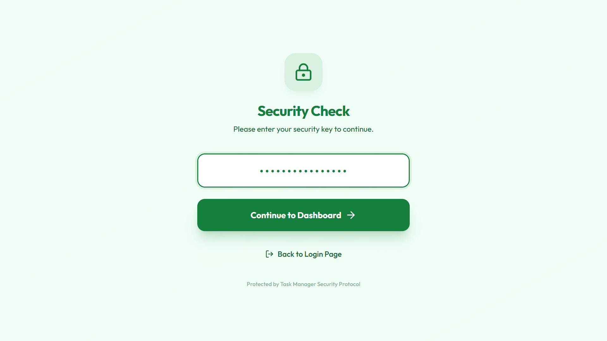
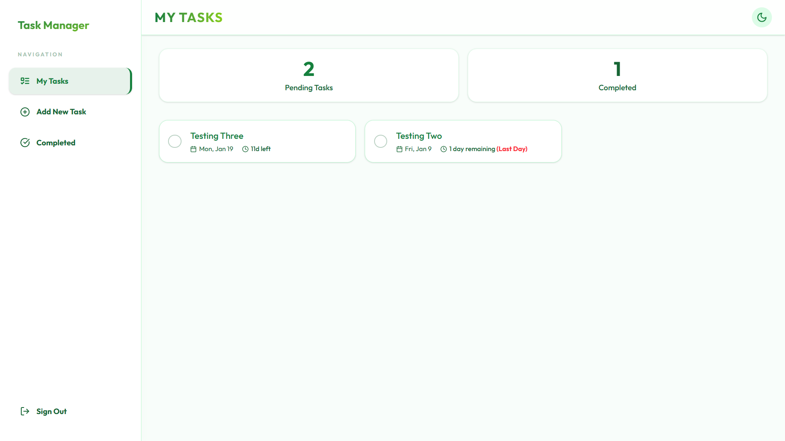
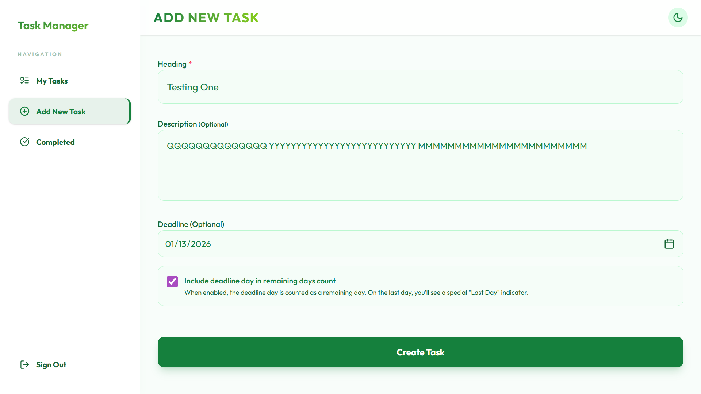
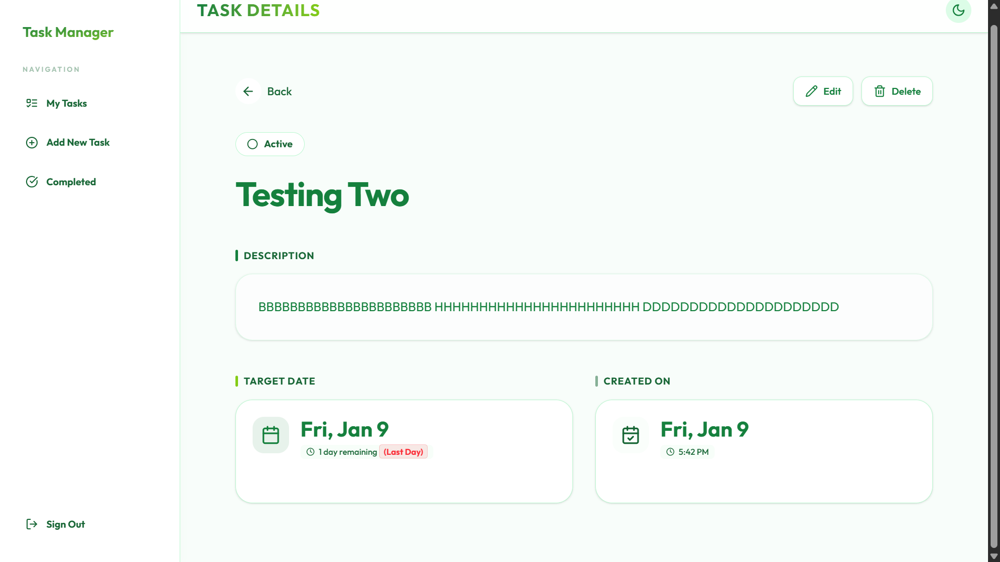
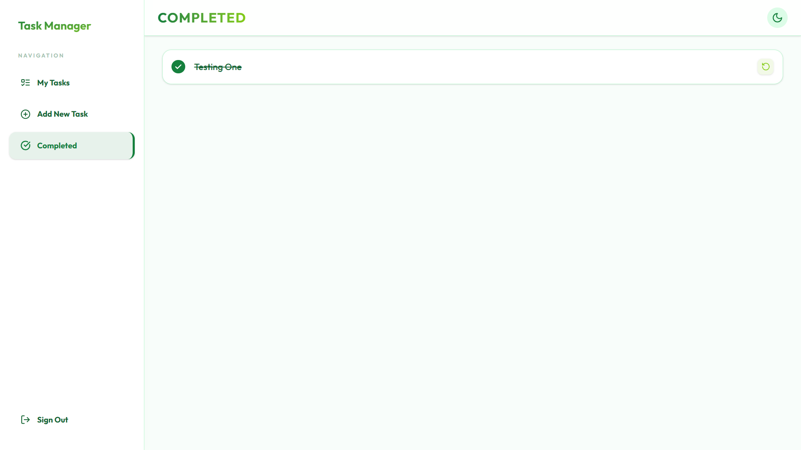

# Your Personal Task Manager

A modern task management application built with React and Firebase. This app helps you organize your daily tasks with an intuitive interface, complete with dark mode support and enhanced security features.


## 📸 App Previews

| | |
|:-------------------------:|:-------------------------:|
|  |  |
|  |  |
|  |  |
|  | |

## Features

### Task Management

- Create, edit, and delete tasks with ease
- Set deadlines with date and time pickers
- Mark tasks as complete and track your progress
- View tasks organized by "Created Today" and "Remaining"
- See your completed tasks in a separate view
- Quick statistics showing pending and completed task counts

### Security & Authentication

- Secure email/password authentication powered by Firebase
- Protected routes ensuring only authenticated users can access tasks
- **Security Key Protection**: Uses a Firestore security key to restrict database access
  - Only users with the correct security key can access their tasks
  - Security key is stored in Firestore Database under the `security` collection
  - Provides an additional layer of protection for your personal data

**Setting up the Security Key in Firebase:**

1. Go to your Firebase Console → Firestore Database
2. Create a new collection called `security`
3. Add a document with ID `1`
4. Add a field called `key` with your chosen security key (e.g., "90741209756")
5. This key will be used to validate access to your tasks

### User Experience

- **Dark/Light Mode**: Automatically detects your system preference, with a manual toggle available
- **Responsive Design**: Works seamlessly on mobile, tablet, and desktop
- **Smooth Animations**: Powered by Framer Motion for a polished feel
- **Toast Notifications**: Get instant feedback for all your actions
- **Confirmation Dialogs**: Prevents accidental deletions
- **Accessibility**: Built with ARIA labels, keyboard navigation, and semantic HTML

### 🌟 Offline Functionality

Experience seamless task management even without internet connection - just like Google Keep and Notion!

- **📱 Full Offline Support**: View, create, edit, and delete tasks without internet
- **💾 Smart Data Caching**: Dual-layer persistence (Firestore IndexedDB + localStorage)
- **🔄 Automatic Sync**: All offline changes sync automatically when reconnected
- **🎨 Professional Indicators**: 
  - Offline: Amber banner showing "You're offline. Viewing cached data."
  - Online: Green banner showing "Back online. Syncing data..."
- **⚡ Optimistic Updates**: Instant UI feedback for all operations
- **🛡️ Zero Data Loss**: Robust error handling and rollback mechanisms
- **📊 No Blank Screens**: Always shows your cached data, even offline

### Progressive Web App (PWA)

- Install the app on your device without visiting an app store
- Works offline with full functionality (create, edit, delete tasks)
- Fast performance with cached assets
- Full-screen standalone mode (no browser UI)
- Mobile-optimized with bottom navigation for easy thumb access
- Automatic updates via service worker

## Getting Started

### What You'll Need

- Node.js version 18 or higher
- pnpm package manager (or npm as an alternative)
- A Firebase account (free tier works fine)

### Setup Instructions

**1. Clone and Install**

```bash
git clone <repository-url>
cd Task Manager
pnpm install
```

> **Note:** This project uses pnpm. If you don't have it installed, run `npm install -g pnpm` or use `npm install` as an alternative.

**2. Firebase Configuration**

Head over to the [Firebase Console](https://console.firebase.google.com) and:

- Create a new project
- Enable Email/Password authentication in the Authentication section
- Create a Firestore database
- Copy your Firebase configuration details

**3. Environment Variables**

Create a `.env` file in the root directory with your Firebase credentials:

```env
VITE_FIREBASE_API_KEY=your_api_key_here
VITE_FIREBASE_AUTH_DOMAIN=your_project_id.firebaseapp.com
VITE_FIREBASE_PROJECT_ID=your_project_id
VITE_FIREBASE_STORAGE_BUCKET=your_project_id.firebasestorage.app
VITE_FIREBASE_MESSAGING_SENDER_ID=your_sender_id
VITE_FIREBASE_APP_ID=your_app_id
```

**4. Run the App**

```bash
pnpm run dev
```

Open your browser and navigate to `http://localhost:5173`

## Project Structure

```
Task Manager/
├── public/              # Static assets and PWA files
├── src/
│   ├── assets/         # Images and icons
│   ├── components/     # Reusable React components
│   │   ├── ConfirmDialog.jsx
│   │   ├── Layout.jsx
│   │   ├── Navbar.jsx
│   │   ├── OfflineIndicator.jsx  # NEW: Network status indicator
│   │   ├── ProtectedRoute.jsx
│   │   ├── TaskCard.jsx
│   │   └── ThemeToggle.jsx
│   ├── context/        # React Context for state management
│   │   ├── AuthContext.jsx
│   │   └── TaskContext.jsx       # Enhanced with offline support
│   ├── hooks/          # Custom React hooks
│   │   └── useNetworkStatus.js   # NEW: Network connectivity hook
│   ├── lib/            # Utility functions and Firebase config
│   │   ├── device.js
│   │   ├── firebase.js           # Enhanced with offline persistence
│   │   ├── timeUtils.js
│   │   └── utils.js
│   ├── pages/          # Page components
│   │   ├── AddTask.jsx
│   │   ├── Completed.jsx
│   │   ├── EditTask.jsx
│   │   ├── ForgotPassword.jsx
│   │   ├── Home.jsx
│   │   ├── Login.jsx
│   │   ├── NotFound.jsx
│   │   └── Signup.jsx
│   ├── App.jsx         # Main app with routing
│   ├── main.jsx        # Entry point
│   └── index.css       # Global styles
├── .env                # Your Firebase credentials (never commit this!)
├── .gitignore
├── IMPLEMENTATION_SUMMARY.md  # NEW: Offline feature summary
├── OFFLINE_FUNCTIONALITY.md   # NEW: Technical documentation
├── TESTING_OFFLINE_MODE.md    # NEW: Testing guide
├── package.json
└── README.md
```

## Security Features

### Security Best Practices

The app follows several security best practices:

- Environment variables are gitignored to prevent credential leaks
- Firebase Security Rules should be configured (see deployment section)
- All forms include input validation
- Password requirements enforce a minimum of 6 characters
- Error messages are designed to not expose sensitive information

## Theme System

The app includes a sophisticated theme system with two modes:

- **Light Theme**: Clean design with a fresh green color palette
- **Dark Theme**: Professional black color scheme that's easy on the eyes

The theme automatically matches your operating system preference, but you can manually toggle between light and dark mode using the button in the header.

## Tech Stack

- **React 19** - Frontend framework
- **Vite 7** - Build tool and dev server
- **React Router DOM 7** - Client-side routing
- **Firebase 12.7** - Authentication and Firestore database
- **Tailwind CSS 4** - Utility-first styling
- **Framer Motion** - Animation library
- **Lucide React** - Icon library
- **Sonner** - Toast notifications
- **date-fns** - Date formatting and manipulation
- **vite-plugin-pwa** - Progressive Web App support with Workbox
- **uuid** - Unique device ID generation

## Deployment

### Building for Production

```bash
pnpm run build
```

This creates an optimized production build in the `dist/` directory.

### Deploying to Vercel

Vercel is the recommended deployment platform:

1. Push your code to a GitHub repository
2. Import the project in your Vercel dashboard
3. Add your environment variables in the Vercel project settings
4. Click deploy and you're done!

### Installing as a PWA

Once deployed, users can install the app on their devices:

**On Desktop (Chrome/Edge):**

1. Visit your deployed URL
2. Look for the install icon (⊕) in the address bar
3. Click it, or go to the browser menu and select "Install Task Manager"
4. The app will open in its own window without browser UI

**On Mobile (Android Chrome):**

1. Open the deployed URL in Chrome
2. Tap "Add to Home Screen" when prompted
3. If you don't see the prompt, tap the menu and select "Add to Home Screen"
4. The app icon will appear on your home screen
5. Tap it to open the app in full-screen mode

**Benefits of PWA Installation:**

- No app store required
- Works offline after first visit
- Faster loading times
- Native app-like experience

## Contributing

Contributions are welcome! If you'd like to improve this project, feel free to fork the repository and submit a pull request.

## License

This project is open source and available under the MIT License.

## Future Enhancements

Here are some features that could be added in the future:

- [ ] Task categories and custom tags
- [ ] Search and filter functionality
- [ ] Priority levels for tasks
- [ ] Recurring tasks
- [ ] Task sharing and collaboration
- [ ] Email notifications for upcoming deadlines
- [ ] Data export and import functionality

## Support

If you run into any issues or have questions, please open an issue in the repository.

---

Built with React and Firebase
