# 🎯 Personal Task Manager (v4.0)

<div align="center">

[](https://react.dev)
[](https://vitejs.dev)
[](https://tailwindcss.com)
[](https://firebase.google.com)
[](https://web.dev/progressive-web-apps/)
[](#)
[](#)
[](#)

[](LICENSE)
[](https://github.com/YashMishra0101/Personal-Task-Manager)
[](https://github.com/YashMishra0101/Personal-Task-Manager/graphs/commit-activity)
[](https://github.com/YashMishra0101/Personal-Task-Manager/pulls)

### 🧑‍💻 Explore the Project • 🐛 Report a Bug • 💡 Request Feature

</div>

---

## 📸 Visual Preview

<div align="center">

| 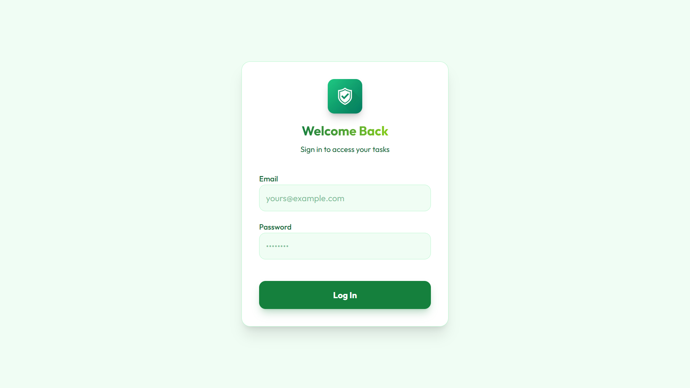 | 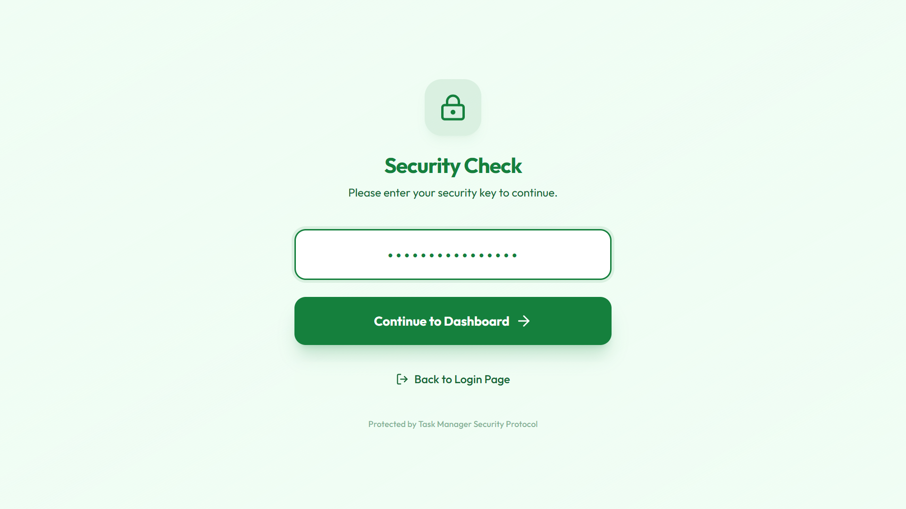 |
| :---: | :---: |
| 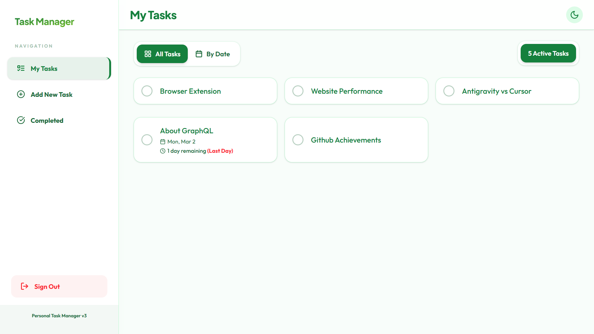 | 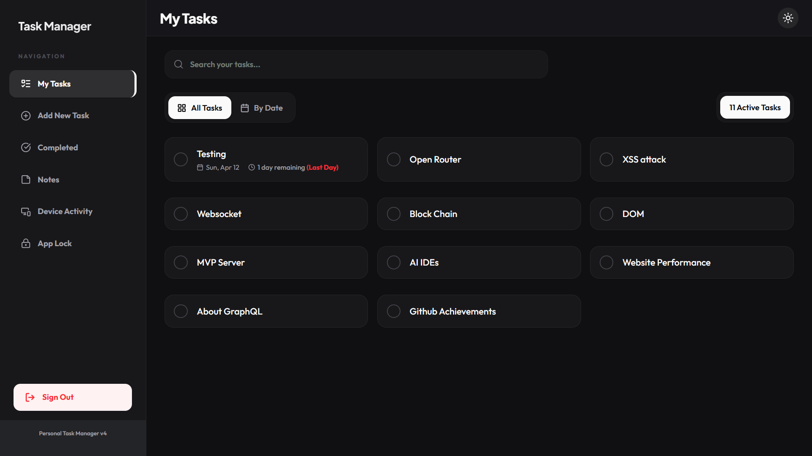 |
| 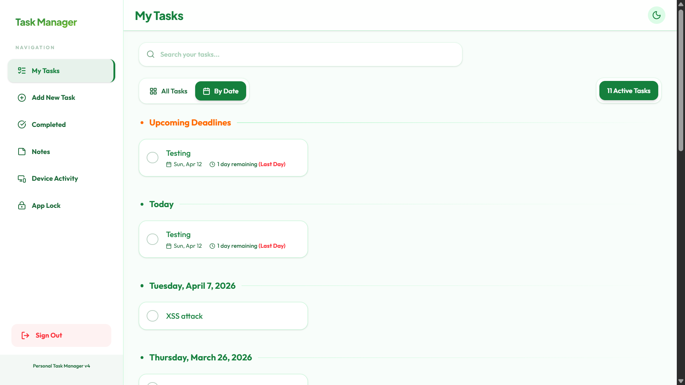 | 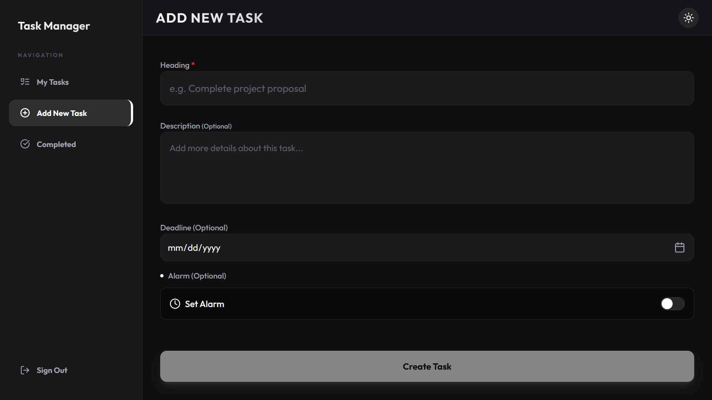 |
| 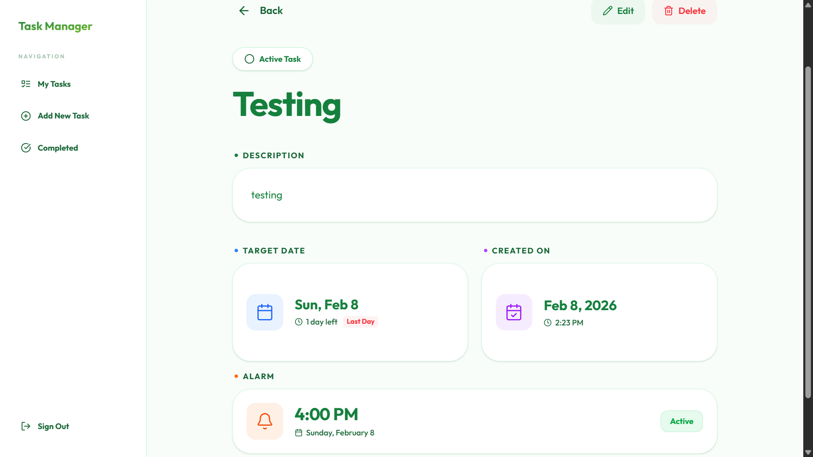 | 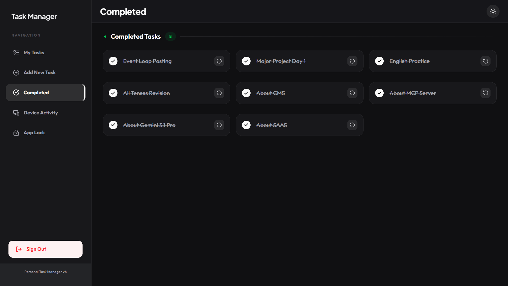 |
| 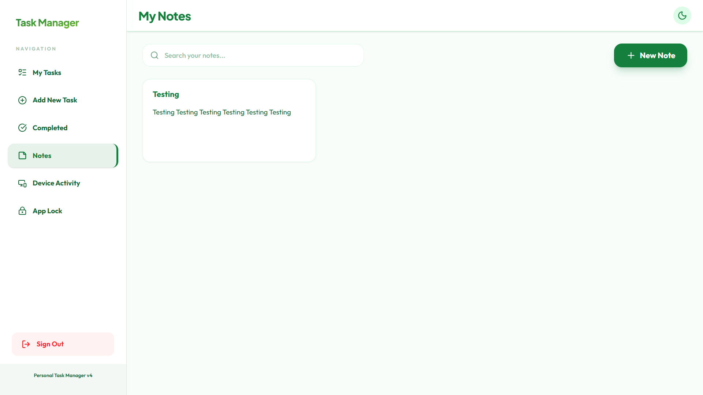 | 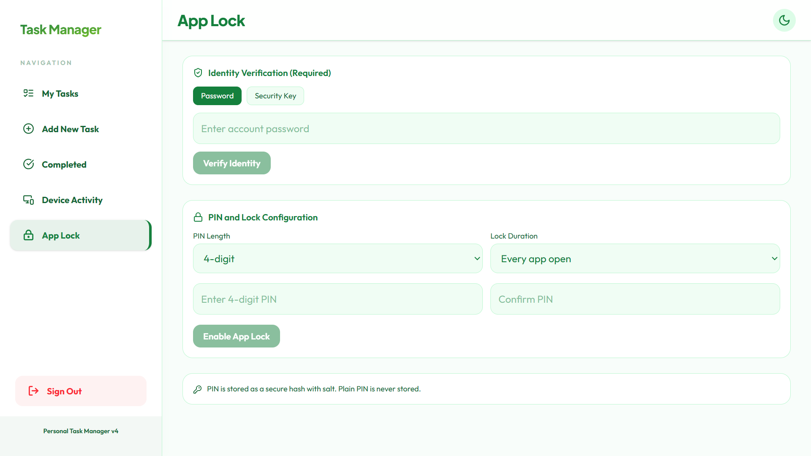 |
| 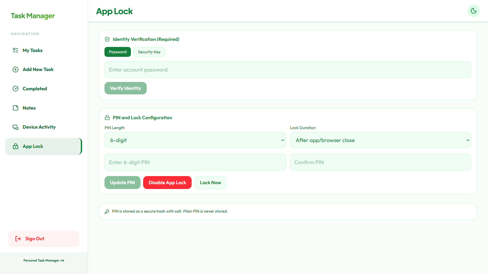 | 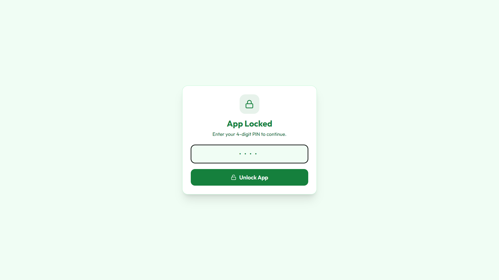 |

</div>

---

## 💎 Why This Project?

This is more than just another **To-Do List**. It is a **Production-Ready Task Management Ecosystem** engineered for high performance, **Robust Security** and a **Seamless Offline-First Experience**. It provides **Multiple Premium Features Completely Free of Cost**, while ensuring total **Privacy**, **Security** and **Absolute Data Ownership**.

> **Born from personal necessity** — not just a project, but my **daily driver**. It's a tool I couldn’t find elsewhere, so I built it to solve my own needs and actively use it every day.

---
## ✨ Feature Deep-Dive

### 🧠 Task Management Features

- **📊 Professional Filtering System**
  - **🗂️ All Tasks (Default)** — Clean, ungrouped grid view for a high-level overview.
  - **📅 By Date** — Smart grouping with relative headers (**Today**, **Yesterday**) and full date labels.
- **⏳ Smart Deadline Prioritization** — Automatically surfaces urgent and upcoming task deadlines at the top of your "By Date" view.
- **🕒 Custom Time Picker** — High-precision time selection implementation with full **12-hour AM/PM** support.
- **✅ Subtasks / Checklist** — Break complex tasks into smaller actionable steps with independent progress tracking.
- **🔄 Drag-and-Drop Reordering** — A high-performance manual reordering system to organize your workspace exactly how you want.
- **🚨 Deadline Tracking** — Dynamic visual indicators and relative countdowns for overdue, urgent, and upcoming tasks.
- **📌 Active Tasks Counter** — Real-time persistent overview of your total pending workload.
- **⚡ One-Click Actions** — Engineered for speed: instantly complete, edit, or delete tasks directly from the dashboard.
- **📖 Detailed Task View** — Rich description support with perfectly formatted date and time metadata.
- **📈 Task Progress Tracking** — Granular completion updates (**0–100%**) with support for marking tasks as "Unsuccessful" for comprehensive productivity auditing.
- **📓 Personal Notes** — A dedicated space for random thoughts and ideas with a minimalist editor and instant search.
- **💰 100% Free & No-Cost Setup** — There are no hidden fees, subscriptions, or payment methods required. You own the code, you own the data, and you pay absolutely nothing to keep it running.
- **📱 Install Anywhere** — Optimized PWA support; install on your **PC, Laptop, or Mobile** device for a seamless "Use Everywhere" experience.

## 🛡️ Privacy & Security
Security isn't a feature; it's the foundation.

- **🚫 Zero-Ad & Zero-Tracking**: No tracking, no analytics, no third-party distractions. 100% focused on your data.
- **⚙️ Full Data Sovereignty**: By cloning this repo and setting up your own Firebase instance, you have **100% control** over your infrastructure.
- **🛡️ Multi-Layered Security**: Optimized integration of Firebase Auth + Custom Security Key + Local App PIN Lock.
- **🔐 Dual-Phase Login**: After standard Firebase Authentication, a secondary **Security Key** verifies the database access permission.
- **🔒 App Lock System**: Configurable PIN-lock (4/6/8 digits) with "Session-based" or "Duration-based" timeouts.
  - **🛠️ Full In-App Control**: Once the app is unlocked, you have **full authority** to update, change, or disable your PIN at any time.
  - **🚫 Forbidden Reset Policy**: For maximum security, there is **no "Forgot PIN" option**. Access must be regained manually via the Firebase Console (Owner only).
- **🕵️ Device Audit**: A comprehensive real-time log of every browser and device that has accessed your account, with unique identifiers and session tracking.
- **💰 Spark Plan Optimized**: Engineered to run efficiently on the **Firebase Free (Spark) Tier**, giving you a production-ready system with $0 infrastructure costs.

---

## 🏗️ Technical Highlights

### ⚡ Cutting-Edge Stack
- **React 19 & Vite 8**: Built on the bleeding edge for optimal developer experience and sub-second HMR.
- **Tailwind CSS 4**: Utilizing the latest JIT engine for ultra-lightweight production CSS.
- **Framer Motion**: Purpose-built micro-interactions that make the UI feel alive and responsive.
- **Offline-First (PWA)**: Using Workbox for intelligent caching. The app works flawlessly in a tunnel or on a plane.

### 🧠 Advanced Architecture
- **Persistent Firestore Cache**: Custom implementation of `persistentLocalCache` for instant data access even on cold starts.
- **Atomic Context State**: State management split via dedicated Context Providers (Auth, AppLock, Tasks) to minimize re-renders.
- **Intelligent Deduplication**: Module-level session management to prevent duplicate Firestore writes during React's StrictMode double-mounts.

---

## 🛠️ Installation & Setup

### Prerequisites
- **Node.js** 20+
- **pnpm** (Recommended) or npm

### Setup Steps
1. **Clone the Repo**
   ```bash
   git clone https://github.com/YashMishra0101/Personal-Task-Manager.git
   cd Personal-Task-Manager
   ```

2. **Install Dependencies**
   ```bash
   pnpm install
   ```

3. **Configure Environment**
   Create a `.env` file from the example:
   ```bash
   cp .env.example .env
   ```
   Fill in your Firebase credentials.

### 🛠️ Detailed Firebase Setup

1. **Create a Firebase Project**: 
   - Go to [Firebase Console](https://console.firebase.google.com/).
   - Click "Add Project" and follow the setup wizard.
   - **Plan**: The free **Spark Plan** is totally sufficient for this application.

2. **Enable Authentication**:
   - Navigate to **Build > Authentication**.
   - Enable the **Email/Password** provider.
   - (Optional) Create your primary user account here or use the app's login flow to register if enabled in rules.

3. **Create Firestore Database**:
   - Navigate to **Build > Firestore Database**.
   - Create a database in **Production Mode** (or test mode if you're quick, but production is recommended).
   - Choose a location nearest to you.

4. **Initialize Security Key**:
   - In Firestore, create a collection named `security`.
   - Create a document with the exact ID `key`.
   - Add a field named `securityKey` (String) and set its value (e.g., `MySecretKey123`).

5. **Register Web App**:
   - Go to **Project Settings (⚙️ icon)**.
   - Click the `</>` icon at the bottom to register a Web App.
   - Copy the `firebaseConfig` object values into your `.env` file.

### 🏁 6. Start Developing
   ```bash
   pnpm dev
   ```

---


## 🤝 Contributing

This is a developer-friendly project! We value:
- **Clean Code**: Follow the existing ESLint and Prettier configs.
- **Performance**: Keep the bundle size small and logic efficient.
- **UX**: Ensure every new feature feels premium.


---

## 📄 License & Attribution

Licensed under the **MIT License**.

> 💡 **Note**: While the license allows free use, I appreciate attribution by linking back to this repository in your project's 'About' section.


> "Great things are done by a series of small things brought together."

<div align="center">

### Built by [Yash RK Mishra](https://github.com/YashMishra0101) with AI tools 👨‍💻

[](https://www.linkedin.com/in/yash-mishra-356280223/)
[](https://x.com/YashRKMishra1)

**[⭐ Star this repository to show your support!](#)**

</div>
